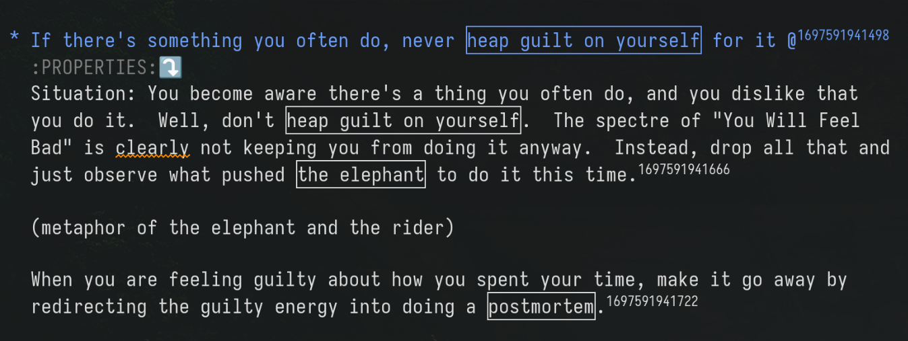
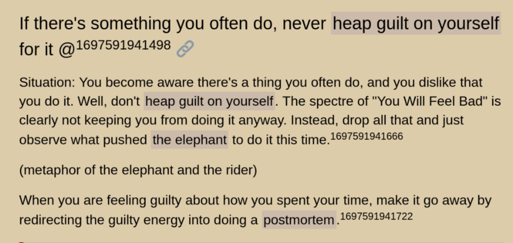

 
# Inline Anki

I've always daydreamed of writing [SRS](https://en.wikipedia.org/wiki/Spaced_repetition#Software) flashcards in a way that flows together with longer "body text" in any of my files, so that the texts serve as a [single-source-of-truth](https://en.wikipedia.org/wiki/Single_source_of_truth).

The other SRS programs in the Emacs ecosystem ([org-fc](https://github.com/l3kn/org-fc), [org-drill](https://gitlab.com/phillord/org-drill), [org-anki](https://github.com/eyeinsky/org-anki), [pamparam](https://github.com/abo-abo/pamparam), [anki-editor](https://github.com/louietan/anki-editor)) all share a fatal flaw: **they separate the flashcards from normal text** by way of shoving them under a dedicated headline.

I don't want to awkwardly append flashcards to the end of an Org section as a kind of paraphrasis or summary of that section, but to let the flashcards serve *as* paragraphs in their own right!

# Set-up

See [the user manual](doc/inline-anki.org).  It's also available inside Emacs by typing `C-h i d m inline-anki RET`.


# Demonstration

We provide four ways to express flashcards.

## Way 1: As running paragraphs

The following two paragraphs express two Anki cloze notes (totalling four cloze deletions).

> In English, we have the word-pair truth and lying.  We also have the word-pair <ins>rational</ins> and rationalization: it's as if lying was called <ins>truthization</ins>.<sup>16900030021</sup>
> 
> A gotcha for inline-anki: you must not <ins>hard-wrap</ins> paragraphs.  If you do, inline-anki will only grab <ins>the last line</ins> of the paragraph.<sup>1690986753420</sup>

## Way 2: As list items, with leading ID

Here are five Anki cloze notes (totalling nine cloze deletions), expressed in just five list items:


-   @<sup>1693000409</sup> 🇫🇷 <ins>chien</ins> 🇬🇧 <ins>dog</ins>
-   @<sup>1693000402</sup> 🇫🇷 <ins>maison</ins>  🇬🇧 <ins>house</ins>
-   @<sup>1693000403</sup> 🇫🇷 <ins>reunion</ins>  🇬🇧 <ins>meeting</ins>
-   @<sup>1690300404</sup> 🇫🇷 <ins>legerdemain</ins>  🇬🇧 <ins>sleight-of-hand</ins>
-   @<sup>1690003421</sup> DRY is short for <ins>Don't Repeat Yourself</ins>

No hidden property drawers or anything.  The source Org syntax is five lines too:

    - @^{1693000409} 🇫🇷 _chien_  🇬🇧 _dog_
    - @^{1693000402} 🇫🇷 _maison_  🇬🇧 _house_
    - @^{1693000403} 🇫🇷 _reunion_  🇬🇧 _meeting_
    - @^{1690300404} 🇫🇷 _legerdemain_  🇬🇧 _sleight-of-hand_
    - @^{1690003421} DRY is short for _Don't Repeat Yourself_

The starting @<sup>number</sup> uniquely identifies the note.  Think of the @ glyph as encircling an "a" for "anki"!

As you've guessed, the underlined parts define cloze deletions.

## Way 3: As list items, with trailing ID

I find it more aesthetic to put the Anki note ID at the end of a list item, when that list item is a member of a longer list of non-flashcard things.

This list expresses, among other things, three Anki cloze notes (totalling four deletions).  You'll note three of the six bullet points never get sent to Anki, since there is nothing to indicate them as Anki notes.

> - "The third virtue is lightness. Let the winds of evidence blow you about as though you are a leaf, with no direction of your own.  Beware lest you fight a rearguard retreat against the evidence, grudgingly conceding each foot of ground only when forced, feeling cheated.  Surrender to the truth as quickly as you can.  Do this the instant you realize what you are resisting, the instant you can see from which quarter the winds of evidence are blowing against you.  Be faithless to your cause and betray it to a stronger enemy."
> - Do not think that fairness to all sides means balancing yourself evenly between positions; truth is not handed out <ins>in equal portions</ins> before the start of a debate.<sup>1695193247566</sup>
> - If you are equally good at explaining <ins>any outcome</ins>, you have zero knowledge.<sup>1695193247617</sup>
> - That which can be destroyed by the truth should be.  (P. C. Hodgell)
>   - Corollary: That which the truth nourishes should thrive.
>     - If the multiverse is real, I desire to <ins>believe the multiverse is real</ins>, and if the multiverse is not real, I desire to believe the multiverse is not real.  Let me not become attached to beliefs I may not want. (application of the <ins>Litany of Tarski</ins>)<sup>1695193247518</sup>


## Way 4: Multiline flashcards in a `#+begin_flashcard` block

So far, the other ways demonstrated all operate on a single line.  To collect multiple lines into a one Anki note, use this Org structure template.

The block below expresses a **single** Anki cloze note (totalling three cloze deletions).

If you're reading this in a web browser, note that this is how it looks in an Org-mode buffer.  I had to show the snippet in this raw form because upon export to the web, the block boundaries disappear and you'd never realize there was anything odd about these paragraphs.

``` org
#+begin_flashcard 165193247510
The _Litany of Tarski_ goes:

1. If the box contains a diamond,
2. _I desire to believe that the box contains a diamond_;
3. _If the box does not contain a diamond_,
4. I desire to believe that the box does not contain a diamond;
5. Let me not become attached to beliefs I may not want.
#+end_flashcard
```

## Why underlines?

Underlines are rare on the web for a reason: people easily mistake them for hyperlinks, so many style guides deprecate them.

Think of underlines as the **handwriting version** of bold text.  They belong on paper, not on a computer screen.  They're not even permitted in Markdown!  I had to hack this README by using `<ins>` HTML tags.

Since we avoid the underline on computer screens... it's free real estate to load with a new semantic.

"But you just said to avoid it!"  Well, the upside compared to **bold**/*italic*/~strikethrough~, is we get **full control of how a cloze deletion should look!**  Here's how I've made it look in my Emacs:



and the [corresponding page on my website](https://edstrom.dev/tsgpf/replacing-guilt#bjwfp) looks like this:



See, no mistaking them for hyperlinks.  To recreate this appearance in Emacs, use this initfile snippet -- which must run before Org loads.

``` elisp
(defface my-cloze '((t . (:box t))) "Cloze face for Inline-Anki")
(setq org-emphasis-alist '(("*" bold)
                           ("/" italic)
                           ("_" my-cloze) ;; new
                           ("=" org-verbatim verbatim)
                           ("~" org-code verbatim)
                           ("+" (:strike-through t))))
```

As for making a blog or epub, Org exports underlines to HTML as `<span class="underline">` (configurable in `org-html-text-markup-alist`), so you can control the final look with a CSS rule on your blog such as the following.

``` css
span.underline {
    text-decoration: none;
    text-color: #111;
    background-color: #bbb;
    padding: 2px;
}
```

### You can still use your chosen emphasis normally

Let's say you prefer to mark clozes with bold.  (That was my default for a while.)  Then you might worry that you can't use bold for anything else?

Don't worry -- whichever emphasis marker you choose, be it _, *, /, +, ~, or =, a paragraph needs a magic string like `@anki` to be parsed as a flashcard in the first place (see [user manual](doc/inline-anki.org)), without which the marker has no special meaning.

The reason I switched to underline was the idea of "*invisible*-anki", a future experiment that eliminates the note IDs in favour of heuristic recognition.  With the note IDs gone, it must reserve an emphasis marker that always means cloze.  I'm early-adopting it.

## Roadmap

-   [ ] Allow hard-wrapping
-   [ ] Fix picture/media export
-   [ ] Define some expressions for a traditional front-back note-type (instead of cloze-deletion)
    -   [ ] As a parameter for `#+begin_flashcard` &#x2013; interpret the last paragraph as the back side.
    -   [ ] As a single-column or single-row 2-cell table.
        -   Very compact: no need for `#+begin_flashcard` nor a blank line in between the fields
        -   [ ] Extend this so that if you have many rows, you can flag the whole table as a table of flashcards where each row is one flashcard.
            -   But that's mainly useful for vocabulary-type stuff, since so little text fits in one table cell.

## Thanks

Thanks a lot to @louietan who wrote <https://github.com/louietan/anki-editor>.  I could reuse its AnkiConnect bindings, which lowered the barrier for me to get started.


## Set-up

See [the user manual](doc/inline-anki.org).  It's also available inside Emacs (after installation) by typing `C-h i d m inline-anki RET`.
